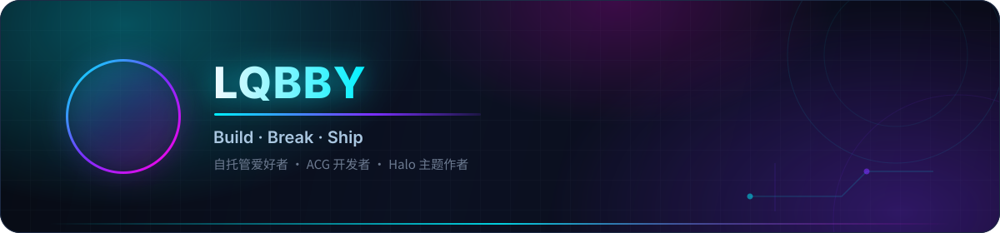
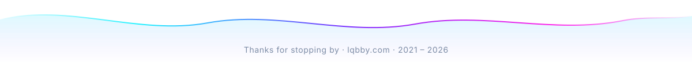

  
  
  
  
  

<h3 align="center">🌟 精选项目 · Featured Projects</h3>

<table>
<tr>
<td width="50%" valign="top">
  

    <a href="https://github.com/lqbby/Halo-Theme-Ethereal"><b>🌌 Halo-Theme-Ethereal</b></a> 
    为 Halo 打造的 Fuwari 风格增强主题 —— Astro 构建、液态分类栏、27 种短代码、深浅双主题。长期维护中。
  

  

    
    
  

</td>
<td width="50%" valign="top">
  

    <a href="https://github.com/lqbby/Tech-Home"><b>🌈 Tech-Home</b></a> 
    一款好看的科技感个人主页 —— 纯前端、开箱即用，PC / 移动端双端自适应。
  

  

    
    
  

</td>
</tr>
<tr>
<td width="50%" valign="top">
  

    <a href="https://github.com/lqbby/acgapi"><b>🎨 acgapi</b></a> 
    LQBBY 随机二次元图片 API —— 一条 URL 一个老婆，稳定无广告。
  

  

    
    
  

</td>
<td width="50%" valign="top">
  

    <a href="https://github.com/lqbby/plugin-recent-comments"><b>🧩 plugin-recent-comments</b></a> 
    Halo 2.x 最近评论聚合插件 —— 匿名 API + Web Component 侧边栏，任意主题可用。
  

  

    
    
  

</td>
</tr>
<tr>
<td width="50%" valign="top">
  

    <a href="https://github.com/lqbby/live2d-kanban"><b>🐱 live2d-kanban</b></a> 
    Live2D 看板娘（fghrsh stack）—— 前端壳 + 模型资源，给你博客找点事干。
  

  

    
    
  

</td>
<td width="50%" valign="top">
  

    <a href="https://github.com/lqbby/ternssh"><b>🔐 ternssh</b></a> 
    轻量 SSH 终端工具 —— 打开即用，不用再开一堆终端窗口。
  

  

    
    
  

</td>
</tr>
</table>

还有 <a href="https://github.com/lqbby/acgurl">acgurl</a> · <a href="https://github.com/lqbby/aria2-onedrive">aria2-onedrive</a> · <a href="https://github.com/lqbby/halo-lsky-pro">halo-lsky-pro</a> · <a href="https://github.com/lqbby/halo-ai-cover-generator">halo-ai-cover-generator</a> 等 —— <a href="https://github.com/lqbby?tab=repositories">全部仓库 →</a>

<h3 align="center">🧰 技术栈 · Tech Stack</h3>

  <b>FRONTEND</b> 
  
  
  
  
  
  
  

  <b>BACKEND &amp; SCRIPT</b> 
  
  
  
  
  

  <b>SELF-HOSTED &amp; DEVOPS</b> 
  
  
  
  
  
  
  
  

<h3 align="center">📊 GitHub 数据 · Stats</h3>

  

<table>
<tr>
<td width="50%" align="center" valign="middle">
  
</td>
<td width="50%" align="center" valign="middle">
  
</td>
</tr>
</table>

  
  
  

<h3 align="center">🤝 找到我 · Connect</h3>

  
  
  
  

⭐ 如果哪个仓库帮到了你，点个 Star 就是最大的鼓励

